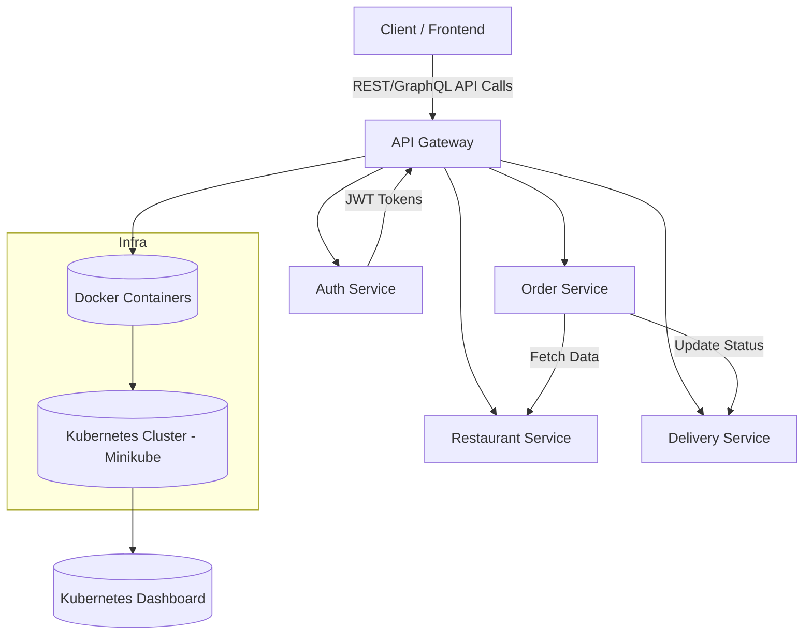

# 🍔 Food Ordering Platform

This project demonstrates a **microservices-based food ordering platform** built using **Spring Boot**, **Kafka**, and **PostgreSQL**.  
It consists of multiple independent services that communicate asynchronously through **Apache Kafka** for event-driven operations.

---

## 🏗️ Architecture Overview

The system follows a **microservices architecture** with the following services:

| Service | Description | Tech Stack |
|----------|--------------|-------------|
| **Order Service** | Handles order creation, updates, and publishes `OrderCreated` events to Kafka. | Spring Boot, Kafka, PostgreSQL |
| **Restaurant Service** | Processes incoming orders, updates restaurant availability, and sends updates back via Kafka. | Spring Boot, Kafka, PostgreSQL |
| **Delivery Service** | Listens to order and restaurant events and manages delivery assignments. | Spring Boot, Kafka, PostgreSQL |
| **Auth Service** | Handles authentication and token validation for API access. | Spring Boot, JWT |

---

## 🔁 Event Flow (Kafka)

1. **Order Service** publishes an `OrderCreated` event to Kafka.  
2. **Restaurant Service** consumes the event → prepares the order → publishes a `RestaurantConfirmed` event.  
3. **Delivery Service** consumes `RestaurantConfirmed` → assigns a delivery person → updates delivery status.  
4. All services maintain their own databases for scalability.

---

## 🧩 Technologies Used

- Spring Boot (Java)  
- Apache Kafka  
- PostgreSQL  
- Docker  
- Kubernetes (Minikube)  
- API Gateway / Ingress  
- Grafana + Prometheus (Monitoring)

---

## 🗂️ Project Structure
```bash
food-ordering-platform/
├── order.service/
│   ├── src/
│   ├── pom.xml
│   └── Dockerfile
├── restaurant.service/
│   ├── src/
│   ├── pom.xml
│   └── Dockerfile
├── delivery.service/
│   ├── src/
│   ├── pom.xml
│   └── Dockerfile
├── auth.service/
│   ├── src/
│   ├── pom.xml
│   └── Dockerfile
└── README.md


## 🚀 Step-by-Step Deployment Guide

### 1️⃣ Build and Dockerize Each Microservice

Each microservice runs independently and has its own `Dockerfile`.

**Steps:**
```bash
# Go inside each service folder
cd food-ordering-platform/order.service

# Build using Maven
mvn clean package

# Build Docker image
docker build -t yourdockerhubuser/order-service:latest .

# Push to Docker Hub (optional)
docker push yourdockerhubuser/order-service:latest
```

Repeat the same steps for:
- `restaurant.service`
- `delivery.service`
- `auth.service`

> 🧩 **Why separate containers?**  
> Each microservice is isolated and independently deployable, improving scalability, fault tolerance, and maintainability.

---

### 2️⃣ Deploy to Kubernetes (Using Minikube)

#### Start a Minikube Cluster
```bash
minikube start
```

#### Create Deployment and Service YAML files
For each microservice, create manifests in a `k8s/` directory.

**Example: `order-service-deployment.yaml`**
```yaml
apiVersion: apps/v1
kind: Deployment
metadata:
  name: order-service
spec:
  replicas: 2
  selector:
    matchLabels:
      app: order-service
  template:
    metadata:
      labels:
        app: order-service
    spec:
      containers:
        - name: order-service
          image: yourdockerhubuser/order-service:latest
          ports:
            - containerPort: 8080
```

**Example: `order-service-service.yaml`**
```yaml
apiVersion: v1
kind: Service
metadata:
  name: order-service
spec:
  type: ClusterIP
  selector:
    app: order-service
  ports:
    - port: 80
      targetPort: 8080
```

#### Apply All Deployments
```bash
kubectl apply -f k8s/order-service-deployment.yaml
kubectl apply -f k8s/order-service-service.yaml
kubectl apply -f k8s/restaurant-service-deployment.yaml
kubectl apply -f k8s/restaurant-service-service.yaml
kubectl apply -f k8s/delivery-service-deployment.yaml
kubectl apply -f k8s/delivery-service-service.yaml
kubectl apply -f k8s/auth-service-deployment.yaml
kubectl apply -f k8s/auth-service-service.yaml
```

Check running pods:
```bash
kubectl get pods
kubectl get svc
```

---

### 3️⃣ Access the Services Locally

Use port forwarding for local testing:
```bash
kubectl port-forward svc/order-service 8080:80
```

Access via browser:  
👉 [http://localhost:8080](http://localhost:8080)

---

### 4️⃣ Access the Kubernetes Dashboard

Run:
```bash
minikube dashboard
```

It will automatically open the dashboard in your browser.

**Analyze the following:**
- **Deployments:** Verify all pods are running, replicas are stable.  
- **Services:** Ensure endpoints are correctly exposed.  
- **Pods:** Check logs, restarts, and container images.  
- **Resources:** Monitor CPU/memory usage.  
- **Scaling:** Try manual scaling:
  ```bash
  kubectl scale deployment order-service --replicas=3
  ```

---

## 🧭 Architecture Overview



---

## 🧩 Key Design Choices

| Component | Purpose | Benefit |
|------------|----------|----------|
| **Docker** | Containerization | Ensures consistent runtime and portability |
| **Kubernetes** | Orchestration | Automated scaling, healing, and rollout |
| **Minikube** | Local Cluster | Simplifies dev/test Kubernetes setup |
| **API Gateway** | Entry Point | Centralized routing, authentication, rate limiting |
| **Microservices** | Modular Design | Independent deployability and fault isolation |
| **GraphQL / REST API** | Data Access Layer | Efficient querying and flexible integration |
| **Monitoring via Dashboard** | Visualization | Easy management and analysis |

---

## 📊 Verification Checklist

- ✅ All pods running in Minikube cluster  
- ✅ Each microservice deployed separately  
- ✅ Services accessible through port-forward or Ingress  
- ✅ Dashboard confirms stable deployments  
- ✅ Logs and events monitored for errors  

---

## 🧠 Learning Outcomes

- Practical understanding of **microservices orchestration**
- Experience with **Docker and Kubernetes integration**
- Exposure to **real-world scalable architecture**
- Ability to monitor and debug deployments via Kubernetes Dashboard

---

## 📚 References

- [Kubernetes Documentation](https://kubernetes.io/docs/home/)
- [Docker Official Guide](https://docs.docker.com/get-started/)
- [Spring Boot Microservices Guide](https://spring.io/guides)
- [Minikube Documentation](https://minikube.sigs.k8s.io/docs/)

---

> ✨ *This project demonstrates a complete CI/CD-ready microservices architecture using Docker, Kubernetes, and Minikube for efficient, scalable deployment.*

